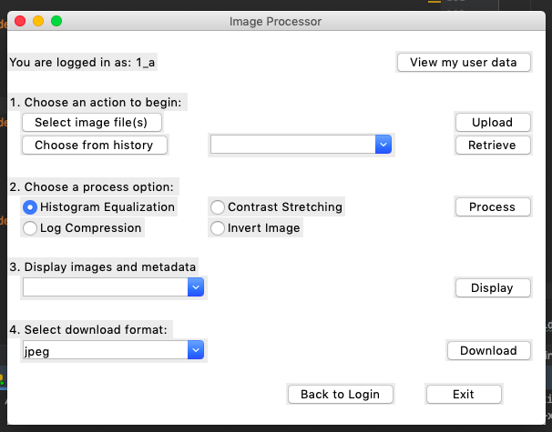
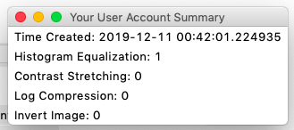
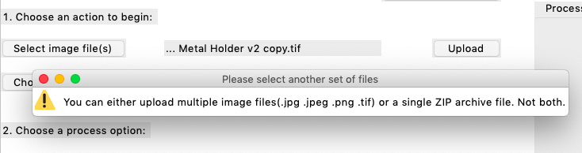
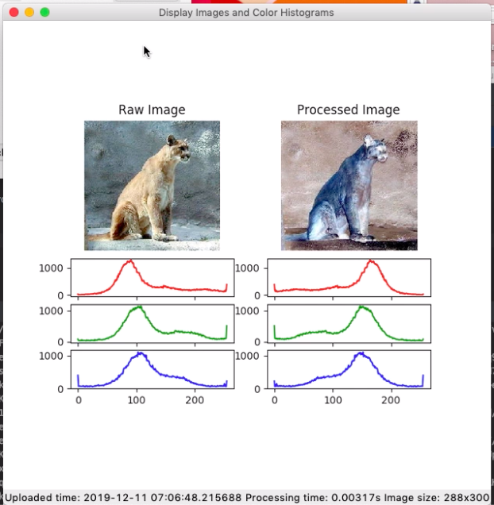

# Image Processor(Fall 2019)


[](https://travis-ci.com/bme547-fall2019/final-project-lucy-liangyu-xiaoyu-ling)  [   ](https://github.com/bme547-fall2019/final-project-lucy-liangyu-xiaoyu-ling/blob/master/LICENSE)


## Overview
Image processing is a widely used technique. To better visualize the imaging processing, we developed a software system to upload an image or an archive of images to a web-server, perform image-processing tasks, and then display
/download your processed image(s) in graphical user interface.

Our software allows user to upload single image in JPEG, PNG or TIFF format or multiple images stored as a zip archive to a webserver. User can choose one of the following processing option:

  + Histogram Equalization __default__
  + Contrast Stretching
  + Log Compression
  + Invert Image (Color)

Our software will display original and processed images which allows user to compare them easily. To store data in user's local computer, our software allows user download any original and processed images in history list as JPEG, PNG or TIFF format (single image) or zip archive(multiple images).

Our software allow user to access the following information: 


  + Timestamp when uploaded
  + CPU time required to process the image(s)
  + Image size (e.g., X x Y pixels)

Finally, we also allow user to retrieve and display the user actions/metrics stored in the cloud database.


## Development setup

Our software is based in python 3 platform. All the packages are stated in `requirements.txt`. Users can build their own virtual environment by using shell command:
```sh
pip install -r requirements.txt
```


##To be finished
Link to deployed web service in yourREADME.md.


## Functional Specifications
### GUI Client


 * Our   __graphical__ user interface for image processor runs as following:


  

* The login interface allows user to type in their own username to access their unique account. 
  * If there is no username in the database, the user can click `Create Account` to create an account in the database. If the user exists in the database, they will have the choice to login or user a different username.
  * If a new user clicks on `Login`, they will be prompted to create an account.
  * If no username is entered, the user will be asked to enter a username.


* After logging in, the user would enter the main interface showing below:
  
 
  * The user account will be displayed at the top of the window. The user can click on `View my user data` to see a summary of their account creation time and image processing history as shown below:
  
  * To begin the image processing process, the user will choose one of two actions. 
    1. By clicking `Select Image File(s)` , the user can select file(s) locally to upload to the web-server. 
    2. The user can also `Choose from history` to retrieve history image data.

#### Select Image File(s)/Upload
* The `Select Image File(s)` button will allow the user to choose an image(in the format of .jpg .jpeg .png .tif), multiple images or a zip archive file. 
  * Selecting multiple .zip files or .zip file mixed with image cells, a warning window will popup during upload.
  
  
  
  * In case the user wants to select a different set of images, they can click on the `Select Image File(s)` button again.
* Clicking the `Upload` button will send the selected images to the server. 
* After uploading the raw image, the __graphical__ user interface 
will let the user choose from the following process options that the server should
perform on the uploaded image:
  + Histogram Equalization __default__
  + Contrast Stretching
  + Log Compression
  + Invert Image (colors, not orientation)
 
* After selecting the process option, press the `Process` button. The processed image will be stored on the server. The drop down box in the __3. Display images and metadata__ section, will update with a list of processed images. The `Display` button will open a window showing the original and processed images with its corresponding color histogram. The display window will also show information of the displayed images at the bottom, including:
    - Timestamp when images are uploaded
    - CPU time required to process the image(s)
    - Image size (e.g., X x Y pixels)
    
    
    
#### Choose from history/Retrieve
* The  `Choose from history` button will collect previous image processing actions of the user and display them as a list in the drop down box.
* The user can select which history they want and click the `Retrieve` button.
* Clicking the `Retrieve` button pulls information of the selected history action through server and update the drop down box in the __3. Display images and metadata__ section with a list of images processed in that history which can be displayed as described above.
 
 
* With the `Download` button, the user can choose to download the image(s) processed from the server in one of the following 
  formats:
    - JPEG
    - PNG
    - TIFF
    - JPG
    - If multiple images are processed, they wil be downloaded as a zip archive.
    
* The `Back to login` button allows the user to return to the login window, and the `Exit` button quits the Image Processing program.


### Cloud Server
* `POST /api/new_user` that takes a JSON as follows:
  ```
  {
      "user_id": "xxxxx"
  }
  ```
    * This route is called to register a new user with the server.  This would occur as the very first step when a user wants to log in to the image server account. 
        + If the user has not been registered in the server, then an account will be created for this id;
        + If the user has been registered in the server, then the user can get access to all of the images that he has posted before.
    * The type of the `"user_id"` should only be `string`.
    * The user id can be any combinations of the letters (either capital or lowercase), numbers and `"_"`, but should not have any symbols (e.g. `"~"`, `"%"`, `"!"`.etc). The input id can contain whitespaces but the ultimate output id removes all of the whitespaces.
    * The length is not limited.
    * Ultimately the server will give the database the json as following.
    ```
     {
          "user_id": "xxxxx"
      }
    ```


* `GET /api/check_id/<user_id>` that return JSON looks like:
  ```
  {
      "result": True or False
  }
  ```
  * This route returns a JSON containing the existence of the input id user_id.
  * True means that there has been a user_id existing in the database;
  * False means that there is no user_id existing in the database;


* `POST /api/upload_images` that takes a JSON as follows:

  ```
  {
      "user_id": "xxxxx",
      "image": ["encoded_image1", "encoded_image2", "encoded_image3", ...],
      "name": ["name1", "name2", "name3", ...],
      "size": [size1, size2, size3, ...]
  }
  ```
    * This route is called to let the user upload image(s).
    * All of the keys in the json should be exactly the same as above. Otherwise, the server will return error code 400.
    * The `"user_id"` should already exist in the database. Otherwise, the server will return error code 400.
    * The `"image"` stores all of the images that this user has uploaded as a list. 
        + The type of each image is string because it needs to be encoded. Otherwise, the server will return error code 400.
    * The `"name"` stores all of the images' filename as a list. 
        + e.g. `01.jpg`, but not the path like `/Users/images/01.jpg`.
    * The `"size"` stores all of the images' size as a list.
        + The type of each size should be a list, e.g. [200, 300, 3], or [200, 300]. Otherwise, the server will return error code 400.
    * The server will save the timestamp when uploading to the database.
        + The timestamp is a string with the format of "year-month-day hour:mimute:second.microsecond".
        + e.g. `"2018-03-09 11:00:36.372339"`
    * Ultimately, the server will give the database the json below.
    ```
    {
        "user_id": "xxxxx",
        "image": ["encoded_image1", "encoded_image2", "encoded_image3", ...],
        "name": ["name1", "name2", "name3", ...],
        "size": [size1, size2, size3, ...]
    }
    ```

* `POST /api/process` that takes a JSON as follows:

  ```
  {
      "user_id": "xxxxx"
      "operation": 0
      "size": [[200,100,3], [150, 150, 1], [100, 80, 3] ...],
      "name": ["01.jpg", "02.jpg", "03.jpg", ...],
      "raw_img": ["encoded1", "encoded2", "encoded3", ...]
  }
  ```

    *  This route is called to let the user process the selected image with the specific operation.
    * The `"user_id"` should already exist in the database. Otherwise, the server will return error code 400.
    * The `operation` is encoded as 0, 1, 2, 3. The `operation` can be a string of number or an integer. But when saved into the database, it should be converted into the integer. Otherwise, the server will return error code 400.
        + 0: Histogram Equalization
        + 1: Contrast Stretching
        + 2: Log Compression
        + 3: Invert Image
    * The `size` should be the list of lists that indicate the size of the image(s). Otherwise, the server will return error code 400.
    * The `name` should be the list of strings with the format of `"name.type"`. Otherwise, the server will return error code 400.
    * The `"raw_img"` should be the list of encoded images (string).
    * The server will process the images with the operation, calculating the running time for each processing on each image.
        * Ultimately, the server will give the json to the database as following.
    ```
      {
          "user_id": "xxxxx"
          "operation": 0
          "up_time": [time1, time2, time3, ...],
          "size": [[200,100,3], [150, 150, 1], [100, 80, 3] ...],
          "run_time": [0.1, 0.2 , 0.1],
          "name": ["01.jpg", "02.jpg", "03.jpg", ...],
          "raw_img": ["encoded1", "encoded2", "encoded3", ...]
          "processed_img": ["processed_encoded1", "processed_encoded2", "processed_encoded3", ...],
          "processed_time": timestamp
      }
    ```


* `GET /api/user_info/<user_id>`  
      This route returns a JSON containing the user information, including the timestamp of creation account, how many images uploads the user has made and the total number of times the user has called each of the various image processing steps.
      The return JSON looks like:

  ```
  {
      "user_id": user_id,
      "created_timestamp":  "2019-12-09 11:01:15.335230",
      "img_num": 10,
      "histeq": 1,
      "constr": 3,
      "logcom": 5,
      "invert": 2
  }
  ```
* `GET /api/history_info/<user_id>`  
  This route returns a JSON containing the user history action information.
  The return JSON looks like:
  ```
  {
      "user_id": user_id,
      "num": [1, 2]
      "processed_time":  [["2019-12-09 11:01:15.335230", "2019-12-09 11:02:15.335230"],
                          ["2019-12-09 12:01:15.335230", "2019-12-09 12:02:15.335230"]]
      "operation": [0, 3],
      "name": [["01.jpg", "02.jpg"], ["03.jpg", "04.jpg"]]
  }
  ```
* `GET /api/history_info/<user_id>/<num>`  
  This route returns a JSON containing the specific one user history action information.
  The return JSON looks like:
 
  ```
  {
      "user_id": user_id,
      "num": 1
      "up_time":  ["2019-12-09 11:01:15.335230", "2019-12-09 11:02:15.335230"]
      "operation": 0,
      "size": [[200, 200, 3], [200, 200, 3]],
      "run_time": [0.3, 0.1],
      "name": ["01.jpg", "02.jpg"]
      "raw_img": ["encoded_img1", "encoded_img2"],
      "processed_img": ["processed_encoded_img1", "processed_encoded_img2"]
  }
  ```

* `GET /api/most_recent_processed_image/<user_id>`  
  This route returns a JSON containing the information about the most recent processed images.
  The return JSON looks like:
 
  ```
  {
      "user_id": user_id,
      "up_time":  ["2019-12-09 11:01:15.335230", "2019-12-09 11:02:15.335230"],
      "operation": 0,
      "size": [[10, 20, 3], [20, 25, 1]],
      "run_time": [0.1, 0.3],
      "name": ["01.jpg", "02.jpg"],
      "raw_img": ["encoded_img1", "encoded_img2"],
      "processed_img": ["processed_encoded_img1", "processed_encoded_img2"]
  }
  ```

* Virtual machine
  - Hostname: vcm-11671.vm.duke.edu
  - port: 5000  
  - The URL for running server is `http://vcm-11671.vm.duke.edu:5000`
 
### Mongo Database

  All of the image data would be saved in [MongoDB](https://www.mongodb.com/). All image user is stored as a collection named image_user. Each query set in the colletion stored as a dictionary in database in the following forms:
```
"user_id": "xxxxx"
"created_timestamp": "2019-12-09 11:01:15.335230"
"metrics": 
       {"img_num": [ ]
        "histeq": [ ]
        "constr": [ ]
        "logcom": [ ]
        "invert": [ ]}
"images":
       {"image": [ ]
        "name": [ ]
        "size": [ ]
        "time": [ ]}
"processed":
       {"num": [ ]
        "up_time": [ ]
        "operation": [ ]
        "processed_time": [ ]
        "size": [ ]
        "run_time": [ ]
        "name": [ ]"
        "raw_img": [ ]
        "processed_img": [ ]}
```

* The `[ ]` above are all empty lists.

* The __`user id`__ is the primary key for each user stored as a string, which means that the id is unique in the database. `created_timestamp` is the time created automatically when user account is created, which is a list contains string elements. 

* The key `img_num` in the __`metrics`__ dictionary stores the total number of original image as int. The `histeq`, `constr`, `logcom` and `invert` keys stores the total number of histogram qualization, contrast stretching, log compression and invert images respectively as int.

* The key `image` in __`images`__ dictionary stores original encoded b64 images as string elements in a list. The key `name` in __`images`__ dictionary stores name of original image as string elements in a list. The key `size` in __`images`__ dictionary stores size of original image as float number in a list. The key `time` in __`images`__ dictionary stores time of uploading original image as string in a list.

* The dictionary stored in the key __`processed`__ is more complicated. Because there can be multiple processed images during function usage, there are nested lists in this case. The `num` in __`processed`__ stores the index of times of uploading processed images, which is "int" type starting from 1. The `up_time` stores the timestamp when processed images is uploaded in the database. The timestamp is list, while the element in the timestamp list is also a list which contains string element storing each single processed images' timestamp during one operation. Similarly, the `operation` is a nested list store the operation index for each single processed images. The following states the rule of numbering the operation:

    + 0: Histogram Equalization
    + 1: Contrast Stretching
    + 2: Log Compression
    + 3: Invert Image
 
  The `size` is a nested list store the size of pixel for each single processed images. For example, [[[200,200,3],[200,200,3]]] tells us the first group of processed images are two  200*200 three-color images. The `run_time`, `name`, `raw_img` and `processed_img` store nested list for running time, name, b-64 corresponding original images and processed images respectively.


## How to use
1. Choose "clone with https" in your repository to your local computer.
2. Open your `Git Bash` and input `git clone` adding with the URL.
3. Create virtual environment by command `python -m venv <venv name>`.
4. Install the required code environment in the `requitements.txt` with the following command: `pip install -r requirements.txt`.
5. Ensure the existence of the python files named `gui.py`, `GUI_client.py`, `image_processing.py`, `image_server.py`, and `initial_database.py` to run the core functions. 
6. The python files starting with `test_` are to test the corresponding functions in other python files. Run the command `pytest -v` in your bash window. It will automatically test all the test functions. If all pass, we are expected to see the following output (just part of it).
    * You can also change the testing arguments and expected results in the `test_xxx.py` and re-run the pytest command.
7. Run the command `python image_server.py` in your bash window to start the server. The log for running the server would be created at the current file path.
8. Run the command `python gui.py` in your bash window to start the graphic operation interface. You can now create your own data in your account.
9. If you want to create the sphinx documentation, you should run following commands to generate HTML documentation. 
    ```
    cd docs
    sphinx-build -M html . _build
    ```
    * This will create `docs/_build/html` with the default webpage being `index.html`. Or the result of webpage that we ran is in the same path in the repository.

## Datasets
Our project  utilize some images from the existing databases.

* <https://medpix.nlm.nih.gov/home>
* http://www.vision.caltech.edu/Image_Datasets/Caltech101/
* <https://www.cs.toronto.edu/~kriz/cifar.html>
* https://github.com/beamandrew/medical-data
* Over 13000 annotated skin lesion images are available from the International
  Skin Imaging Collaboration (ISIC) project:
  https://isic-archive.com. 


## Reference
https://github.com/dward2/BME547/blob/master/Assignments/final_image_processor.md
